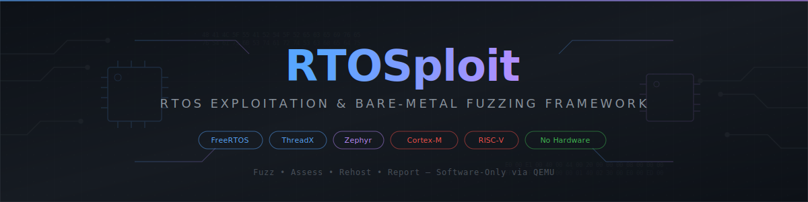

<p align="center">
  
</p>

<p align="center">
  
  <a href="#4-installation"></a>
  
  
  
  
</p>

<p align="center">
  <strong>Author:</strong> Santhosh Ballikonda
</p>

---

RTOSploit is a security testing framework purpose-built for embedded RTOS firmware. It combines static analysis, CVE correlation, vulnerability assessment, exploit and payload generation, peripheral firmware auto-rehosting, grey-box fuzzing, and automated reporting — all running entirely in software via QEMU emulation. No physical hardware required.

| | |
|---|---|
| **Supported RTOSes** | FreeRTOS, ThreadX, Zephyr, ESP-IDF, RTEMS (detection) |
| **Architectures** | ARM Cortex-M (M0/M3/M4/M7/M33), RISC-V (RV32I/RV64), Xtensa, MIPS, AArch64 |
| **Binary Formats** | ELF, Intel HEX, Motorola S-Record, Raw binary |
| **Exploit Modules** | 15 modules across FreeRTOS, ThreadX, and Zephyr |
| **Tests** | 1370+ unit tests |
| **License** | GPL-3.0-only |

---

## Table of Contents

1. [Purpose](#1-purpose)
2. [Architecture](#2-architecture)
3. [Features](#3-features)
4. [Installation](#4-installation)
5. [Quick Start](#5-quick-start)
6. [Usage Guide](#6-usage-guide)
7. [CLI Reference](#7-cli-reference)
8. [Exploit Modules](#8-exploit-modules)
9. [Machine Configurations](#9-machine-configurations)
10. [Configuration](#10-configuration)
11. [CI/CD Integration](#11-cicd-integration)
12. [Development](#12-development)
13. [Troubleshooting](#13-troubleshooting)
14. [Documentation](#14-documentation)

---

## 1. Purpose

Embedded RTOS firmware (FreeRTOS, ThreadX, Zephyr) runs on billions of devices — medical implants, automotive ECUs, industrial PLCs, IoT gateways — yet security testing tools for these targets are fragmented, hardware-dependent, and expensive. RTOSploit closes this gap.

**What RTOSploit does (in order of a typical workflow):**

1. **Static Analysis** — Fingerprints RTOS type, version, MCU family, heap allocator, MPU configuration, and peripheral usage from a firmware binary alone
2. **CVE Correlation** — Matches detected RTOS type and version against NVD CVE data to identify known vulnerabilities
3. **Vulnerability Assessment** — Runs 15 exploit modules that detect known vulnerability patterns (heap corruption, MPU bypass, ISR hijacking, BLE overflows)
4. **Exploit & Payload Generation** — Generates concrete exploit artifacts: overflow buffers, ROP chains, shellcode, and malformed packets
5. **Firmware Rehosting** — Boots firmware in QEMU with auto-detected peripheral models, HAL function intercepts, and smart MMIO fallback — zero manual configuration
6. **Grey-Box Fuzzing** — Fuzzes the running firmware with AFL-compatible coverage tracking, crash deduplication, and multi-worker parallelism
7. **Reporting** — Produces SARIF (for GitHub/IDE integration) and HTML reports with exploitability classification

**What RTOSploit does NOT do:**

- Execute exploits against live hardware (it's a software-only assessment tool)
- Symbolic execution or concolic analysis (lightweight register tracking, not angr/Fuzzware)
- Linux kernel or application-level fuzzing (RTOS/bare-metal only)
- Hardware-in-the-loop via JTAG/SWD

---

## 2. Architecture

RTOSploit is organized into layered subsystems. Data flows from firmware loading through analysis, emulation, and testing, converging into a unified reporting pipeline.

```
                            RTOSploit Architecture
 ┌─────────────────────────────────────────────────────────────────────────┐
 │                              CLI / Interactive TUI                      │
 │  analyze | rehost | fuzz | exploit | scan | triage | report | console  │
 └────┬──────────┬──────────┬──────────┬──────────┬──────────┬────────────┘
      │          │          │          │          │          │
      ▼          │          │          │          │          │
 ┌─────────┐    │          │          │          │          │
 │ Firmware │    │          │          │          │          │
 │ Loader   │    │          │          │          │          │
 │          │    │          │          │          │          │
 │ ELF/HEX │    │          │          │          │          │
 │ SREC/RAW │    │          │          │          │          │
 └────┬─────┘    │          │          │          │          │
      │          │          │          │          │          │
      ▼          ▼          │          │          │          │
 ┌──────────────────────┐   │          │          │          │
 │   Static Analysis    │   │          │          │          │
 │                      │   │          │          │          │
 │ RTOS Fingerprint     │   │          │          │          │
 │ Heap Detection       │   │          │          │          │
 │ MPU Analysis         │   │          │          │          │
 │ String Extraction    │   │          │          │          │
 │ Peripheral Detection │◄──┘          │          │          │
 │  (6-layer engine)    │             │          │          │
 └────┬────────┬────────┘             │          │          │
      │        │                      │          │          │
      │        ▼                      │          │          │
      │   ┌───────────────────┐       │          │          │
      │   │  Auto-Config      │       │          │          │
      │   │  Generator        │       │          │          │
      │   │                   │       │          │          │
      │   │ MCU→QEMU Mapping  │       │          │          │
      │   │ SVD Model Loading │       │          │          │
      │   │ HAL Hook Matching │       │          │          │
      │   │ Peripheral Filter │       │          │          │
      │   └────────┬──────────┘       │          │          │
      │            │                  │          │          │
      │            ▼                  ▼          │          │
      │   ┌──────────────────────────────────┐   │          │
      │   │      Emulation Engine            │   │          │
      │   │                                  │   │          │
      │   │  ┌──────────┐  ┌──────────────┐  │   │          │
      │   │  │   QEMU   │  │   Unicorn    │  │   │          │
      │   │  │  +GDB    │  │  (alt engine)│  │   │          │
      │   │  └────┬─────┘  └──────┬───────┘  │   │          │
      │   │       │               │           │   │          │
      │   │       ▼               ▼           │   │          │
      │   │  ┌───────────────────────────┐    │   │          │
      │   │  │  Peripheral Intercept     │    │   │          │
      │   │  │                           │    │   │          │
      │   │  │ Layer 1: SVD Register     │    │   │          │
      │   │  │ Layer 2: HAL Hooks        │    │   │          │
      │   │  │ Layer 3: MMIO Fallback    │    │   │          │
      │   │  │ Layer 4: System Registers │    │   │          │
      │   │  └───────────────────────────┘    │   │          │
      │   └──────────────────────────────────┘   │          │
      │                    │                      │          │
      │                    ▼                      ▼          │
      │   ┌──────────────────────────────────────────────┐   │
      │   │          Security Testing                    │   │
      │   │                                              │   │
      │   │  ┌─────────────┐  ┌───────────────────────┐  │   │
      │   │  │  Fuzzing     │  │  Exploit Assessment   │  │   │
      │   │  │  Engine      │  │                       │  │   │
      │   │  │              │  │  15 modules:          │  │   │
      │   │  │ Coverage     │  │  FreeRTOS (6)         │  │   │
      │   │  │ Mutation     │  │  ThreadX (3)          │  │   │
      │   │  │ Dedup        │  │  Zephyr (6)           │  │   │
      │   │  │ Multi-worker │  │                       │  │   │
      │   │  └──────┬───────┘  └───────────┬───────────┘  │   │
      │   │         │                      │              │   │
      │   └─────────┼──────────────────────┼──────────────┘   │
      │             │                      │                  │
      │             ▼                      ▼                  ▼
      │   ┌────────────────────────────────────────────────────────┐
      │   │                Post-Processing                        │
      │   │                                                        │
      │   │  Crash Triage → Exploitability Classification          │
      │   │  Input Minimization → Minimal reproducing cases        │
      │   │  CVE Correlation → Known vulnerability matching        │
      │   │  Coverage Analysis → Instruction-level hit maps        │
      │   └───────────────────────┬────────────────────────────────┘
      │                           │
      ▼                           ▼
 ┌───────────────────────────────────────────┐
 │              Reporting                    │
 │                                           │
 │  SARIF 2.1.0  │  HTML Dashboard  │  JSON  │
 │  (CI/IDE)     │  (human review)  │ (API)  │
 └───────────────────────────────────────────┘
```

### Peripheral Interception Architecture

When firmware accesses a memory-mapped peripheral register, the request flows through a 4-layer handler chain:

```
  Firmware MMIO Access (e.g., write to 0x40004400)
          │
          ▼
  ┌─────────────────────────────┐
  │ 1. System Registers         │  0xE0000000 - 0xE00FFFFF
  │    SysTick, NVIC, SCB, FPU  │  Cortex-M PPB region
  │    (sensible defaults)      │
  └──────────┬──────────────────┘
             │ not system register
             ▼
  ┌─────────────────────────────┐
  │ 2. SVD Peripheral Models    │  From CMSIS-SVD files
  │    Register-level accuracy  │  Read/write tracking
  │    Smart status heuristics  │  Clear-on-read for events
  └──────────┬──────────────────┘
             │ no SVD match
             ▼
  ┌─────────────────────────────┐
  │ 3. HAL Function Hooks       │  112 HAL functions mapped
  │    STM32 HAL (42 funcs)     │  nRF5 SDK (50 funcs)
  │    Zephyr RTOS (20 funcs)   │  Return realistic values
  └──────────┬──────────────────┘
             │ no HAL match
             ▼
  ┌─────────────────────────────┐
  │ 4. Smart MMIO Fallback      │  Catch-all handler
  │    Ready-bit on first read  │  Echo-back written values
  │    Poll loop detection      │  Access logging
  └─────────────────────────────┘
```

### Peripheral Detection Engine (6 Layers)

The detection engine identifies which peripherals firmware uses, even on fully stripped binaries:

| Layer | Method | Weight | Works on stripped binaries? |
|-------|--------|--------|---------------------------|
| 1. Symbol | Match symbols against 112-entry HAL database | 0.6 | No (needs symbols) |
| 2. String | SDK source file names, driver references | 0.4 | Yes (survives in assert strings) |
| 3. Relocation | ELF relocation table entries | 0.7 | Partially (needs .dynsym) |
| 4. Register | MMIO register access via Capstone disassembly | 0.9/0.8 | Yes (primary method) |
| 5. Signature | Binary patterns for HAL init sequences | 0.7 | Yes |
| 6. Devicetree | Zephyr devicetree node patterns | 0.8 | Yes (Zephyr only) |

Evidence from all layers is aggregated with weighted scoring. Confidence levels: **HIGH** (>1.2), **MEDIUM** (0.6-1.2), **LOW** (<0.6).

---

## 3. Features

### 3.1 Static Analysis (No QEMU Required)

| Analysis | What it detects | Output |
|----------|----------------|--------|
| **RTOS Fingerprint** | FreeRTOS/ThreadX/Zephyr/ESP-IDF/RTEMS, version, confidence score | RTOS type, version string |
| **MCU Family Detection** | nRF52, STM32F4, ESP32, LPC, SAM, RP2040, etc. | MCU family string |
| **Heap Allocator** | FreeRTOS heap_1–heap_5, ThreadX byte pools, Zephyr slabs | Allocator type, heap base |
| **MPU Configuration** | ARM Cortex-M MPU regions, executable/writable overlaps | Region map, vulnerabilities |
| **Peripheral Detection** | UART, SPI, I2C, GPIO, BLE, Timer, etc. via 6-layer engine | Peripheral list with confidence |
| **String Extraction** | RTOS markers, SDK references, error messages | Classified string list |
| **Rehost Readiness** | Can this firmware be auto-rehosted? Score 0-100% | QEMU machine, SVD, HAL hooks |

### 3.2 CVE Intelligence

- **CVE Correlation** — match detected RTOS type and version against bundled NVD database
- **CVE Search** — free-text search across CVE IDs, descriptions, product names
- **NVD Sync** — pull latest entries from NIST NVD API (with rate limit backoff)
- **VulnRange Labs** — CTF-style CVE reproduction challenges with progressive hints

### 3.3 Vulnerability Assessment & Exploit Generation

15 built-in modules that detect vulnerability patterns and generate concrete artifacts:

| Category | Modules | What they produce |
|----------|---------|-------------------|
| Heap Corruption | 4 | Overflow buffers, fake metadata, write primitives |
| MPU Bypass | 2 | Privilege escalation payloads, ROP chains |
| ISR Hijacking | 1 | Vector table redirect payloads |
| BLE Exploits | 4 | Malformed advertising/L2CAP/ASCS packets |
| Kernel Attacks | 2 | TCB/thread entry overwrites, syscall chains |
| Reconnaissance | 2 | Userspace config detection, race conditions |

Each module provides:
- `check` — non-destructive vulnerability assessment (safe to run in CI)
- `exploit` — generates payload artifacts (buffer, addresses, chain)
- Optional `inject` — writes payload into live QEMU via GDB (when emulation is active)

**Payload Generation** (standalone):
- ARM Thumb2 and RISC-V shellcode templates (NOP sled, infinite loop, MPU disable, VTOR redirect)
- ROP gadget finder with bad-character filtering
- XOR and null-free encoders

### 3.4 Automatic Firmware Rehosting

RTOSploit can boot firmware with **zero manual configuration**:

```bash
rtosploit rehost -f firmware.elf
```

This single command:
1. Detects RTOS type, version, architecture, and MCU family
2. Resolves the correct QEMU machine (16 machine configs available)
3. Downloads and parses the CMSIS-SVD file for register-level peripheral modeling
4. Matches firmware symbols against 112 HAL function entries (STM32/nRF5/Zephyr)
5. Creates SVD-backed peripheral models for accessed peripherals
6. Sets up HAL function intercepts via GDB breakpoints
7. Configures smart MMIO fallback for unmapped addresses
8. Boots firmware in QEMU

**Vendor HAL Models:**

| Vendor | Peripherals Modeled | HAL Functions |
|--------|-------------------|---------------|
| STM32 HAL | UART, SPI, I2C, GPIO, RCC, Flash, Timer | 42 |
| Nordic nRF5 SDK | UART, SPI, TWI, GPIO, BLE (SoftDevice), Timer, Clock, Power | 50 |
| Zephyr RTOS | UART, SPI, I2C, GPIO, BLE, Device binding, Sleep | 20 |

**Alternative Engine:** Unicorn-based emulation (optional) for MMIO-heavy workloads — 10-100x faster than QEMU+GDB for pure peripheral testing.

### 3.5 Grey-Box Fuzzing

- QEMU-based firmware fuzzer with AFL-compatible coverage bitmaps
- **Auto mode** (`--auto`): fingerprints firmware, discovers input points via HAL database, injects fuzz data through HAL receive functions — no manual `--inject-addr` needed
- Crash deduplication (PC + CFSR + nearby-PC + backtrace frame matching)
- Seed corpus management and coverage-guided mutation
- Multi-worker parallel execution (`--jobs N`)
- Live dashboard: executions/sec, crash count, coverage percentage
- Optional native Rust fuzzer binary for maximum throughput
- Interrupt injection via NVIC for ISR-triggered code paths

### 3.6 Post-Fuzzing Analysis

- **Crash Triage** — classify exploitability: EXPLOITABLE, PROBABLY_EXPLOITABLE, PROBABLY_NOT, UNKNOWN
- **Input Minimization** — automatically reduce crash inputs to minimal reproducing cases
- **Coverage Visualization** — instruction-level hit maps (terminal and HTML)

### 3.7 Reporting

| Format | Purpose | Integration |
|--------|---------|------------|
| SARIF 2.1.0 | Machine-readable findings | GitHub Code Scanning, VS Code, Azure DevOps |
| HTML | Human-readable dashboard | Executive review, sharing |
| JSON | API consumption | Scripting, tool chaining |

CI exit codes: `0` = clean, `1` = findings above threshold, `2` = error.

### 3.8 Interactive Mode

Arrow-key TUI with contextual menus. Load firmware, and RTOSploit auto-detects everything:

```
? What would you like to do?
> Load Firmware
  ──────────────
  Quick Scan (CI Pipeline)
  Search CVE Database
  ──────────────
  Interactive Console (Metasploit-style)
  ──────────────
  Settings
  Exit
```

After loading, the firmware menu provides all actions: boot, fuzz, exploit, analyze, triage, report.

**Metasploit-Style Console:**
```
rtosploit> use freertos/heap_overflow
rtosploit(freertos/heap_overflow)> show options
rtosploit(freertos/heap_overflow)> set firmware ./fw.bin
rtosploit(freertos/heap_overflow)> check
rtosploit(freertos/heap_overflow)> exploit
```

---

## 4. Installation

### Requirements

- Python 3.10+
- QEMU 9.0+ with `qemu-system-arm` and/or `qemu-system-riscv32` in PATH
- Optional: Rust toolchain for native fuzzer binary
- Optional: `unicorn` Python package for alternative emulation engine

### From Source

```bash
git clone https://github.com/Indspl0it/RTOSploit
cd rtosploit
python -m venv .venv
source .venv/bin/activate       # Windows: .venv\Scripts\activate
pip install -e ".[dev]"
```

### Install QEMU

**Debian/Ubuntu:**
```bash
sudo apt install qemu-system-arm qemu-system-misc
```

**macOS (Homebrew):**
```bash
brew install qemu
```

**Windows (WSL2):**
```bash
sudo apt install qemu-system-arm qemu-system-misc
```

**Verify:**
```bash
qemu-system-arm --version   # Must report 9.0.0 or later
rtosploit --version          # Should print version
```

### Optional: Native Rust Fuzzer

The native fuzzer provides real coverage-guided mutation. Without it, RTOSploit runs in simulation mode (still useful for pipeline testing):

```bash
cargo build --release -p rtosploit-fuzzer
```

### Optional: Unicorn Engine

For MMIO-heavy workloads without QEMU overhead:

```bash
pip install unicorn
```

See [docs/installation.md](docs/installation.md) for detailed platform-specific instructions.

---

## 5. Quick Start

### Auto-Rehost Firmware (Zero Config)

```bash
rtosploit rehost -f firmware.elf
```

RTOSploit auto-detects RTOS, MCU, peripherals, and boots the firmware.

### Full Security Scan (CI/CD)

```bash
rtosploit scan \
  -f firmware.elf \
  --fuzz-timeout 120 \
  --format both \
  --output ./results \
  --fail-on high
```

### Static Analysis Only

```bash
rtosploit analyze -f firmware.elf --all
```

### Auto-Fuzz (Discovers Input Points)

```bash
rtosploit fuzz -f firmware.elf --auto --timeout 300
```

### CVE Check

```bash
rtosploit cve scan -f firmware.elf
```

### Interactive Mode

```bash
rtosploit
```

---

## 6. Usage Guide

### 6.1 Workflow: Analyze → Rehost → Fuzz → Triage → Report

This is the typical end-to-end workflow for assessing a firmware binary:

```bash
# Step 1: Understand the firmware
rtosploit analyze -f firmware.elf --all
# Output: RTOS type, version, MCU, heap, MPU, peripherals

# Step 2: Check rehosting readiness
rtosploit analyze -f firmware.elf --rehost-check
# Output: QEMU machine, SVD availability, HAL hooks, readiness score

# Step 3: Boot firmware with auto-rehosting
rtosploit rehost -f firmware.elf --save-config auto_config.yaml
# Boots firmware, saves generated peripheral config for inspection

# Step 4: Fuzz with auto-discovered input points
rtosploit fuzz -f firmware.elf --auto --timeout 600 --output fuzz-out

# Step 5: Triage crashes
rtosploit triage -c fuzz-out/crashes -f firmware.elf --format sarif -o triage.sarif

# Step 6: Generate reports
rtosploit report -i fuzz-out -o reports --format both

# Step 7: Check known CVEs
rtosploit cve scan -f firmware.elf
```

### 6.2 Workflow: Exploit Assessment

```bash
# List all available exploit modules
rtosploit exploit list

# Check if firmware is vulnerable (non-destructive)
rtosploit exploit check freertos/heap_overflow -f firmware.elf -m mps2-an385

# Generate exploit artifacts
rtosploit exploit run freertos/mpu_bypass -f firmware.elf -m mps2-an385

# Interactive console for iterative testing
rtosploit console
> use freertos/heap_overflow
> set firmware ./fw.elf
> set machine mps2-an385
> check
> exploit
```

### 6.3 Workflow: CI/CD Pipeline

```bash
# One command, returns exit code for CI
rtosploit scan \
  -f firmware.elf \
  --fuzz-timeout 60 \
  --format sarif \
  --output scan-output \
  --fail-on critical

# Exit code 0 = pass, 1 = findings, 2 = error
echo $?
```

### 6.4 JSON Output for Scripting

Every command supports `--json` for machine-readable output:

```bash
# Pipe RTOS detection to jq
rtosploit --json analyze -f firmware.elf --detect-rtos | jq '.rtos'

# Script fuzz result processing
rtosploit --json fuzz -f fw.elf --auto --timeout 60 | jq '.stats'

# CVE data for external tools
rtosploit --json cve scan -f firmware.elf | jq '.cves[] | select(.severity == "critical")'
```

### 6.5 Saving and Reusing Auto-Generated Configs

```bash
# Generate and save peripheral config
rtosploit rehost -f firmware.elf --save-config my_config.yaml

# Edit the config to customize peripheral behavior
vim my_config.yaml

# Reuse the edited config
rtosploit rehost -f firmware.elf -p my_config.yaml
```

---

## 7. CLI Reference

### Global Flags

Available before any subcommand:

| Flag | Short | Description |
|------|-------|-------------|
| `--verbose` | `-v` | Enable DEBUG-level logging |
| `--quiet` | `-q` | Suppress INFO messages |
| `--json` | | Machine-readable JSON output |
| `--config PATH` | | Custom `.rtosploit.yaml` config |
| `--version` | | Print version and exit |

---

### `analyze`

Static firmware analysis. Runs without QEMU.

```
rtosploit analyze -f PATH [FLAGS]
```

| Option | Description |
|--------|-------------|
| `-f, --firmware PATH` | Firmware binary (required) |
| `--detect-rtos` | Fingerprint RTOS type, version, confidence |
| `--detect-heap` | Identify heap allocator and base address |
| `--detect-mpu` | Analyze ARM MPU regions and vulnerabilities |
| `--strings` | Extract and classify embedded strings |
| `--detect-peripherals` | 6-layer peripheral detection engine |
| `--rehost-check` | Check auto-rehosting readiness (0-100% score) |
| `--all` | Run all analyses |

```bash
# Full analysis
rtosploit analyze -f firmware.elf --all

# JSON for scripting
rtosploit --json analyze -f firmware.elf --all | jq '.peripherals'

# Rehost readiness check
rtosploit analyze -f firmware.elf --rehost-check
```

<details>
<summary>Example JSON output</summary>

```json
{
  "firmware": "firmware.elf",
  "rtos": {
    "detected": "freertos",
    "version": "10.4.3",
    "confidence": 0.92,
    "architecture": "armv7m",
    "mcu_family": "stm32f4"
  },
  "peripherals": {
    "architecture": "armv7m",
    "mcu_family": "stm32f4",
    "peripherals": {
      "UART": {"type": "uart", "confidence": 1.50, "confidence_level": "high"},
      "SPI": {"type": "spi", "confidence": 0.90, "confidence_level": "medium"}
    }
  },
  "rehost_check": {
    "readiness_score": 85,
    "qemu_machine": "netduino2",
    "svd_available": true,
    "hal_hooks": 12
  }
}
```
</details>

---

### `rehost`

Auto-rehost firmware with peripheral interception.

```
rtosploit rehost -f PATH [OPTIONS]
```

| Option | Default | Description |
|--------|---------|-------------|
| `-f, --firmware PATH` | required | Firmware binary |
| `-m, --machine TEXT` | auto-detect | QEMU machine name |
| `-p, --peripheral-config PATH` | auto-generate | YAML peripheral config |
| `--auto / --no-auto` | auto when no config | Auto-detect peripherals |
| `--save-config PATH` | — | Save auto-generated config |
| `--svd PATH` | — | Override SVD file |
| `--engine [qemu\|unicorn]` | qemu | Emulation engine |
| `-t, --timeout INTEGER` | 0 (unlimited) | Timeout in seconds |

```bash
# Zero-config auto-rehost
rtosploit rehost -f firmware.elf

# With explicit machine
rtosploit rehost -f firmware.elf -m mps2-an385

# Save config for editing
rtosploit rehost -f firmware.elf --save-config config.yaml

# Unicorn engine (faster, no QEMU needed)
rtosploit rehost -f firmware.elf --engine unicorn

# Custom SVD file
rtosploit rehost -f firmware.elf --svd STM32F407.svd
```

---

### `emulate`

Launch QEMU emulation without peripheral interception.

```
rtosploit emulate -f PATH -m NAME [OPTIONS]
```

| Option | Default | Description |
|--------|---------|-------------|
| `-f, --firmware PATH` | required | Firmware binary |
| `-m, --machine TEXT` | required | QEMU machine name |
| `--gdb` | false | Enable GDB remote stub |
| `--gdb-port INTEGER` | 1234 | GDB stub port |
| `--serial-port INTEGER` | — | Forward UART to TCP port |
| `--svd PATH` | — | SVD file for peripherals |

```bash
# Basic boot
rtosploit emulate -f firmware.elf -m mps2-an385

# With GDB debugging
rtosploit emulate -f firmware.elf -m mps2-an385 --gdb
# Then: arm-none-eabi-gdb -ex "target remote :1234" firmware.elf
```

---

### `fuzz`

Grey-box firmware fuzzing.

```
rtosploit fuzz -f PATH [OPTIONS]
```

| Option | Default | Description |
|--------|---------|-------------|
| `-f, --firmware PATH` | required | Firmware binary |
| `-m, --machine TEXT` | required (unless `--auto`) | QEMU machine |
| `--auto` | false | Auto-discover inputs, auto-detect machine |
| `--rtos [freertos\|threadx\|zephyr\|auto]` | auto | Target RTOS |
| `-o, --output PATH` | fuzz-output | Output directory |
| `-t, --timeout INTEGER` | 0 | Timeout in seconds |
| `-j, --jobs INTEGER` | 1 | Parallel workers |
| `--persistent` | false | Use persistent mode (faster) |
| `--inject-addr TEXT` | 0x20010000 | Input injection address (hex) |
| `--peripheral-config PATH` | — | HAL intercept config |

```bash
# Fully automatic
rtosploit fuzz -f firmware.elf --auto --timeout 300

# Manual configuration
rtosploit fuzz -f firmware.elf -m mps2-an385 -t 600 -j 4

# With seed corpus
rtosploit fuzz -f firmware.elf -m mps2-an385 --seed ./seeds -o ./fuzz-out
```

**Live Dashboard:**
```
┌─────────────── RTOSploit Fuzzer Dashboard ───────────────┐
│ Elapsed Time    00:05:23                                  │
│ Executions      48,392                                    │
│ Exec/sec        149.9                                     │
│ Crashes Found   3                                         │
│ Coverage %      12.4%                                     │
│ Corpus Size     31                                        │
└───────────────────────────────────────────────────────────┘
```

---

### `exploit`

Exploit module assessment and payload generation.

**Subcommands:** `list`, `info`, `check`, `run`

```bash
# List all modules
rtosploit exploit list

# Module details
rtosploit exploit info freertos/heap_overflow

# Non-destructive check
rtosploit exploit check freertos/mpu_bypass -f firmware.elf -m mps2-an385

# Generate artifacts
rtosploit exploit run freertos/heap_overflow \
  -f firmware.elf -m mps2-an385 \
  --option PAYLOAD_ADDRESS=0x20001000
```

---

### `cve`

CVE database operations.

**Subcommands:** `scan`, `search`, `update`

```bash
# Scan firmware for applicable CVEs
rtosploit cve scan -f firmware.elf

# Search by term
rtosploit cve search "heap overflow"
rtosploit cve search CVE-2021-31571

# Update from NVD
rtosploit cve update --api-key YOUR_KEY
```

---

### `triage`

Crash classification and input minimization.

```
rtosploit triage -c DIR -f PATH [OPTIONS]
```

| Option | Default | Description |
|--------|---------|-------------|
| `-c, --crash-dir PATH` | required | Crash JSON directory |
| `-f, --firmware PATH` | required | Firmware binary |
| `-m, --machine TEXT` | mps2-an385 | QEMU machine |
| `--minimize/--no-minimize` | minimize | Minimize inputs |
| `--format [text\|json\|sarif]` | text | Output format |
| `-o, --output PATH` | stdout | Output file |

**Exploitability Classes:**

| Class | Meaning |
|-------|---------|
| EXPLOITABLE | PC control confirmed |
| PROBABLY_EXPLOITABLE | Partial control or write-what-where |
| PROBABLY_NOT_EXPLOITABLE | Crash without meaningful influence |
| UNKNOWN | Insufficient data |

---

### `coverage`

Coverage visualization.

**Subcommands:** `stats`, `view`

```bash
# Coverage statistics
rtosploit coverage stats -f firmware.elf -b coverage.bitmap

# Terminal visualization
rtosploit coverage view -f firmware.elf -b coverage.bitmap

# HTML report
rtosploit coverage view -f firmware.elf -t trace.log --format html -o coverage.html
```

---

### `report`

Generate SARIF and/or HTML reports.

```bash
rtosploit report -i ./scan-output -o ./reports --format both
rtosploit report -i ./crashes -o ./reports --format sarif
```

---

### `scan`

Full end-to-end security scan pipeline (CI/CD mode).

```
rtosploit scan -f PATH [OPTIONS]
```

| Option | Default | Description |
|--------|---------|-------------|
| `-f, --firmware PATH` | required | Firmware binary |
| `-m, --machine TEXT` | mps2-an385 | QEMU machine |
| `--fuzz-timeout INTEGER` | 60 | Fuzzing duration (seconds) |
| `--format [sarif\|html\|both]` | both | Report format |
| `-o, --output PATH` | scan-output | Output directory |
| `--fail-on [critical\|high\|medium\|low\|any]` | critical | Exit code threshold |
| `--skip-fuzz` | false | Skip fuzzing phase |
| `--skip-cve` | false | Skip CVE correlation |

**Pipeline Phases:** Load → Fingerprint → CVE Correlate → Fuzz → Triage → Report

**Exit Codes:** `0` = clean, `1` = findings above threshold, `2` = error

---

### `console`

Metasploit-style interactive REPL.

```bash
rtosploit console
```

| Command | Description |
|---------|-------------|
| `use <module>` | Load exploit module |
| `show options` | List module options |
| `show info` | Module details |
| `set <key> <value>` | Set option |
| `check` | Non-destructive probe |
| `exploit` / `run` | Generate artifacts |
| `search <term>` | Search modules |
| `back` | Deselect module |
| `exit` | Quit |

---

### `payload`

Shellcode and ROP chain generation.

**Subcommands:** `shellcode`, `rop`

```bash
# ARM infinite loop
rtosploit payload shellcode --arch armv7m --type infinite_loop

# MPU disable shellcode as C array
rtosploit payload shellcode --arch armv7m --type mpu_disable --format c

# RISC-V NOP sled
rtosploit payload shellcode --arch riscv32 --type nop_sled --length 32

# ROP chain to disable MPU
rtosploit payload rop -b firmware.elf --goal mpu_disable

# With bad character filtering
rtosploit payload rop -b firmware.elf --goal vtor_overwrite --bad-chars 000a0d
```

**Shellcode Types:** `nop_sled`, `infinite_loop`, `mpu_disable`, `vtor_redirect`, `register_dump`
**ROP Goals:** `mpu_disable`, `vtor_overwrite`, `write_what_where`
**Formats:** `raw`, `hex`, `c`, `python`
**Encoders:** `raw`, `xor`, `nullfree`

---

### `svd`

CMSIS-SVD peripheral definition file operations.

```bash
# Parse and display
rtosploit svd parse STM32F407.svd

# Download from repository
rtosploit svd download --device nRF52840

# Generate C stubs
rtosploit svd generate STM32F407.svd --mode fuzzer --output ./stubs
```

---

### `vulnrange`

CVE reproduction lab with progressive hints.

```bash
rtosploit vulnrange list                          # List challenges
rtosploit vulnrange start CVE-2021-43997          # Start a challenge
rtosploit vulnrange hint CVE-2021-43997 --level 2 # Get a hint
rtosploit vulnrange solve CVE-2021-43997          # Run reference solution
rtosploit vulnrange writeup CVE-2021-43997        # Full writeup
```

---

## 8. Exploit Modules

### FreeRTOS (6 modules)

| Module | Category | CVE | Description |
|--------|----------|-----|-------------|
| `freertos/heap_overflow` | Heap Corruption | — | BlockLink_t unlink → arbitrary write to TCB pxTopOfStack |
| `freertos/tcb_overwrite` | Memory Corruption | — | Direct pxTopOfStack overwrite via write primitive |
| `freertos/isr_hijack` | ISR Hijacking | — | VTOR exception vector redirection (SVC/PendSV/SysTick) |
| `freertos/mpu_bypass` | MPU Bypass | CVE-2021-43997 | xPortRaisePrivilege() callable from unprivileged (v10.2–10.4.5) |
| `freertos/mpu_bypass_rop` | MPU + ROP | CVE-2024-28115 | Stack overflow ROP chain to disable MPU (v10.0–10.6.1) |
| `freertos/tcp_stack` | Network | CVE-2018-16525, CVE-2018-16528 | DNS/LLMNR response overflow |

### ThreadX (3 modules)

| Module | Category | Description |
|--------|----------|-------------|
| `threadx/byte_pool` | Heap Corruption | TX_BYTE_POOL unlink → arbitrary write to thread entry |
| `threadx/kom` | Kernel | Kernel Object Masquerading — syscall chaining (USENIX Security 2025) |
| `threadx/thread_entry` | Code Execution | Direct tx_thread_entry function pointer overwrite |

### Zephyr (6 modules)

| Module | Category | CVE | Description |
|--------|----------|-----|-------------|
| `zephyr/ble_overflow` | BLE | CVE-2024-6259 | Extended advertising report heap overflow (<3.7.0) |
| `zephyr/ble_cve_2023_4264` | BLE | CVE-2023-4264 | BT Classic L2CAP overflow (<3.5.0) |
| `zephyr/ble_cve_2024_6135` | BLE | CVE-2024-6135 | Missing bounds in BT processing (<3.7.0) |
| `zephyr/ble_cve_2024_6442` | BLE | CVE-2024-6442 | ASCS global buffer overflow (<3.7.0) |
| `zephyr/syscall_race` | Race Condition | GHSA-3r6j-5mp3-75wr | SVC handler TOCTOU (<4.3.0) |
| `zephyr/userspace_off` | Reconnaissance | — | Detects CONFIG_USERSPACE=n |

---

## 9. Machine Configurations

Machine YAML files in `configs/machines/`. Use the filename stem as `--machine`:

| Machine | QEMU Target | CPU | Architecture | Use Case |
|---------|-------------|-----|-------------|----------|
| `mps2-an385` | MPS2 AN385 | Cortex-M3 | armv7m | Generic ARM testing (default) |
| `mps2-an505` | MPS2 AN505 | Cortex-M33 | armv8m | TrustZone-enabled testing |
| `stm32f4` | STM32VLDISCOVERY | Cortex-M4 | armv7m | STM32 HAL firmware |
| `microbit` | micro:bit | Cortex-M0 | armv6m | nRF51/nRF52 firmware |
| `lm3s6965evb` | LM3S6965EVB | Cortex-M3 | armv7m | TI Stellaris firmware |
| `netduinoplus2` | Netduino Plus 2 | Cortex-M4 | armv7m | STM32F4-based boards |
| `musca-a` | Musca-A | Cortex-M33 | armv8m | ARMv8-M TrustZone |
| `sifive_e` | SiFive E | E31 | riscv32 | RISC-V testing |
| `sifive_u` | SiFive U | U54 | riscv64 | RISC-V 64-bit |

### Adding a Custom Machine

```yaml
# configs/machines/my-board.yaml
machine:
  name: my-board
  qemu_machine: mps2-an385
  cpu: cortex-m4
  architecture: armv7m

memory:
  flash:
    base: 0x00000000
    size: 0x00100000
  sram:
    base: 0x20000000
    size: 0x00020000

peripherals:
  uart0:
    base: 0x40001000
    size: 0x1000
    irq: 5
```

---

## 10. Configuration

RTOSploit loads config in precedence order (later overrides earlier):

1. Built-in defaults
2. `~/.config/rtosploit/config.yaml` — user-wide
3. `.rtosploit.yaml` — project-level
4. `--config PATH` — explicit override
5. CLI flags — highest priority

```yaml
# .rtosploit.yaml
qemu:
  binary: /usr/local/bin/qemu-system-arm
  timeout: 30

gdb:
  port: 1234

output:
  format: json
  color: true

fuzzer:
  default_timeout: 120
  jobs: 2
```

Environment variables use `RTOSPLOIT_` prefix:
```bash
RTOSPLOIT_QEMU_BINARY=/opt/qemu/bin/qemu-system-arm rtosploit emulate -f fw.elf -m mps2-an385
```

---

## 11. CI/CD Integration

### GitHub Actions

```yaml
name: Firmware Security Scan
on: [push, pull_request]

jobs:
  scan:
    runs-on: ubuntu-latest
    steps:
      - uses: actions/checkout@v4
      - run: sudo apt install -y qemu-system-arm
      - run: pip install -e .
      - run: |
          rtosploit scan \
            -f firmware.elf \
            --fuzz-timeout 120 \
            --format sarif \
            --output scan-output \
            --fail-on high
      - uses: github/codeql-action/upload-sarif@v3
        with:
          sarif_file: scan-output/report.sarif.json
        if: always()
```

### GitLab CI

```yaml
firmware-scan:
  image: python:3.12
  before_script:
    - apt-get update && apt-get install -y qemu-system-arm
    - pip install -e .
  script:
    - rtosploit scan -f firmware.elf --fuzz-timeout 60 --output scan-output --fail-on critical
  artifacts:
    paths: [scan-output/]
    reports:
      sast: scan-output/report.sarif.json
```

### Makefile

```makefile
security-scan:
	rtosploit scan -f $(FIRMWARE) --fuzz-timeout $(FUZZ_TIMEOUT) --output scan-output --fail-on high
```

See [docs/ci-integration.md](docs/ci-integration.md) for Docker, JSON scripting, and advanced examples.

---

## 12. Development

### Running Tests

```bash
python -m pytest tests/unit/ -v                    # All tests
python -m pytest tests/unit/test_analysis.py -v    # Specific file
python -m pytest tests/unit/ --cov=rtosploit       # With coverage
```

### Project Layout

```
rtosploit/
├── cli/                        CLI entry point and subcommands
│   ├── main.py                 Global flags, command routing
│   └── commands/               One file per subcommand (14 commands)
├── analysis/                   Static firmware analysis
│   ├── fingerprint.py          RTOS type + version detection
│   ├── heap_detect.py          Heap allocator identification
│   ├── mpu_check.py            ARM MPU region analysis
│   ├── strings.py              String extraction
│   └── detection/              6-layer peripheral detection engine (11 files)
├── peripherals/                Peripheral modeling and rehosting
│   ├── auto_config.py          Fingerprint → PeripheralConfig generator
│   ├── hal_database.py         112 HAL function entries (STM32/nRF5/Zephyr)
│   ├── svd_model.py            CMSIS-SVD data model
│   ├── svd_parser.py           SVD XML parser with derivedFrom, dim arrays
│   ├── svd_cache.py            SVD download/cache (multi-URL fallback)
│   ├── rehost.py               RehostingEngine with auto_mode
│   ├── dispatcher.py           GDB breakpoint-based function interception
│   ├── mmio_intercept.py       GDB watchpoint-based MMIO interception
│   ├── unicorn_engine.py       Unicorn-based alternative engine
│   ├── interrupt_injector.py   NVIC interrupt injection
│   └── models/                 Vendor HAL implementations
│       ├── stm32_hal.py        STM32 UART/SPI/I2C/GPIO/RCC/Flash/Timer
│       ├── nrf5_hal.py         nRF5 UART/SPI/TWI/GPIO/BLE/Timer
│       ├── zephyr_hal.py       Zephyr UART/SPI/I2C/GPIO/BLE
│       ├── svd_peripheral.py   SVD register-level model
│       ├── mmio_fallback.py    Smart MMIO fallback + system registers
│       └── generic.py          ReturnZero, ReturnValue, LogAndReturn
├── exploits/                   Exploit assessment framework
│   ├── base.py                 ExploitModule ABC
│   ├── registry.py             Auto-discovery
│   ├── runner.py               Assessment orchestration
│   ├── runtime_bridge.py       GDB-based payload injection
│   ├── freertos/               6 FreeRTOS modules
│   ├── threadx/                3 ThreadX modules
│   └── zephyr/                 6 Zephyr modules
├── fuzzing/                    Grey-box fuzzing engine
│   ├── engine.py               Multi-worker orchestration
│   ├── corpus.py               Seed corpus management
│   ├── mutator.py              Input mutation
│   ├── crash_reporter.py       Dedup (PC + CFSR + backtrace)
│   └── input_injector.py       HAL-based fuzz input routing
├── emulation/                  QEMU orchestration
│   ├── qemu.py                 Process lifecycle
│   ├── qmp.py                  QEMU Machine Protocol
│   ├── gdb.py                  GDB stub integration
│   └── machines.py             Machine YAML loading
├── cve/                        CVE intelligence
│   ├── database.py             JSON CVE store
│   ├── correlator.py           RTOS → CVE matching
│   └── nvd_client.py           NVD API (with retry backoff)
├── triage/                     Crash classification
│   ├── pipeline.py             Load → classify → minimize
│   ├── classifier.py           Exploitability scoring
│   └── minimizer.py            Input minimization
├── payloads/                   Payload generation
│   ├── shellcode.py            ARM + RISC-V templates
│   └── rop.py                  Gadget finder + chain builder
├── coverage/                   Coverage analysis
│   ├── bitmap_reader.py        AFL bitmap parsing
│   ├── mapper.py               Address-level mapping
│   └── visualizer.py           Terminal + HTML rendering
├── reporting/                  Report generation
│   ├── models.py               Finding + Report dataclasses
│   ├── sarif.py                SARIF 2.1.0 generator
│   └── html.py                 HTML dashboard
├── console/                    Metasploit-style REPL
├── interactive/                Arrow-key TUI
├── ci/                         Scan pipeline orchestration
└── vulnrange/                  CVE reproduction labs
```

### Writing an Exploit Module

See [docs/writing-exploits.md](docs/writing-exploits.md). Quick template:

```python
from rtosploit.exploits.base import ExploitModule, ExploitResult

class MyExploit(ExploitModule):
    name = "my_exploit"
    description = "Description of vulnerability"
    rtos = "freertos"
    category = "heap_corruption"
    reliability = "medium"

    def check(self, target, payload=None):
        # Return True if vulnerable
        ...

    def exploit(self, target, payload=None):
        # Generate and return ExploitResult with artifacts
        ...

    def requirements(self):
        return {"symbols": True, "version": ">=10.0.0"}

    def cleanup(self, target):
        pass
```

---

## 13. Troubleshooting

### QEMU not found

```
Error: QEMU binary not found
```

Install QEMU 9.0+ and ensure `qemu-system-arm` is in your PATH:
```bash
qemu-system-arm --version
```

On macOS: `brew install qemu`. On Ubuntu: `sudo apt install qemu-system-arm`.

### SVD download fails (404)

```
ERROR: Failed to download SVD from https://...
```

The CMSIS-SVD GitHub repository URLs change periodically. RTOSploit tries multiple fallback URLs automatically. If all fail:
1. Download the SVD manually from [cmsis-svd](https://github.com/cmsis-svd/cmsis-svd-data)
2. Use `--svd /path/to/file.svd` to provide it directly

### Auto-rehost doesn't detect peripherals

- Run `rtosploit analyze -f firmware.elf --detect-peripherals` to see what was detected
- Stripped binaries rely on the register MMIO layer (Capstone disassembly) — this requires executable sections
- If confidence is LOW, the firmware may use unusual HAL patterns not in the 112-function database

### Fuzzer reports 0 exec/sec

- Ensure firmware actually boots (try `rtosploit emulate -f firmware.elf -m mps2-an385` first)
- Check QEMU machine compatibility — wrong machine = firmware hangs at boot
- Try `--auto` mode which auto-selects the machine

### Exploit check says "not_vulnerable" but CVE matches

Exploit modules assess specific binary patterns (symbols, heap metadata layout, version strings). A CVE match based on version doesn't guarantee the specific vulnerable code path is present in your build — the vendor may have backported the fix.

### Import errors (capstone, pyelftools)

```bash
pip install -e ".[dev]"  # Reinstall with all dependencies
```

For Xtensa architecture support, ensure Capstone 5.0+ is installed. Some distributions ship older versions.

### Unicorn engine not available

```
ImportError: unicorn package not installed
```

The Unicorn engine is optional. Install with `pip install unicorn` for the `--engine unicorn` option. QEMU mode works without it.

### Permission denied on QMP socket

RTOSploit creates temporary sockets in a secure temp directory. If you see permission errors:
- Check `/tmp` has write permissions
- On Docker, ensure the container has tmpfs access
- Set `$TMPDIR` to an alternative location if needed

### Large firmware causes timeouts

The signature detection layer caps scanning at 512KB per executable section. For firmware >1MB, detection may be incomplete. Use `--svd` to provide peripheral definitions directly.

### Tests fail after upgrade

```bash
# Clean and reinstall
pip install -e ".[dev]" --force-reinstall

# Run specific test to diagnose
python -m pytest tests/unit/test_analysis.py -v -x
```

---

## 14. Documentation

Detailed docs in the [`docs/`](docs/) directory:

| Document | Description |
|----------|-------------|
| [Installation](docs/installation.md) | Full platform setup: QEMU, Python, Rust fuzzer, NVD API key |
| [Quick Start](docs/quickstart.md) | Step-by-step walkthrough |
| [CI Integration](docs/ci-integration.md) | GitHub Actions, GitLab CI, Docker, Makefile |
| [Writing Exploits](docs/writing-exploits.md) | Module template, options, testing |
| [Writing VulnRanges](docs/writing-vulnranges.md) | Lab layout, manifest schema, hints |
| [Crash Triage](docs/crash-triage.md) | CFSR flags, exploitability, minimization |
| [CVE Correlation](docs/cve-correlation.md) | Database schema, matching, NVD sync |
| [Coverage](docs/coverage.md) | AFL bitmap format, visualization |
| [Reporting](docs/reporting.md) | SARIF structure, HTML dashboard, IDE integration |

---

## License

GPL-3.0-only. See [LICENSE](LICENSE) for details.
