# Architecture

RTOSploit is organized as a layered Python package with an optional native Rust component for performance-critical fuzzing. The system is designed around three entry points — interactive mode, CLI subcommands, and a programmatic Python API — all sharing the same core analysis and emulation engine.

---

## System Overview

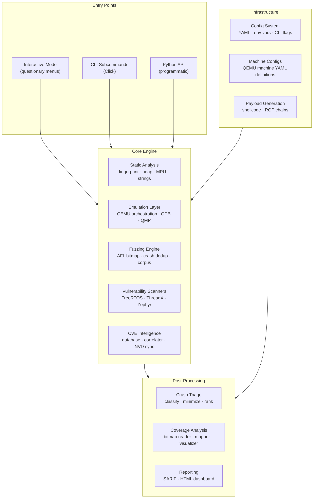

---

## Entry Point Routing

When `rtosploit` is invoked, `main()` in `cli/main.py` inspects `sys.argv` before Click parses anything:

```mermaid
flowchart LR
    invoke["rtosploit invoked"] --> check{"sys.argv\nhas subcommand?"}
    check -- "No args or\nonly global flags" --> interactive["InteractiveApp.run()"]
    check -- "Subcommand present\n(scan, fuzz, ...)" --> click["Click CLI\ndispatch"]
    check -- "--help or\n--version" --> help["Print and exit"]
    interactive --> app["InteractiveApp\nmenu loop"]
    click --> cmd["Click Command\nhandler"]
```

Global flags (`--verbose`, `--quiet`, `--json`, `--config`, `--debug`) are always evaluated regardless of routing path.

---

## Interactive Mode Architecture

The interactive mode is built around a single `InteractiveApp` instance that holds an `InteractiveSession` and dispatches menu selections to lazy-imported handlers.

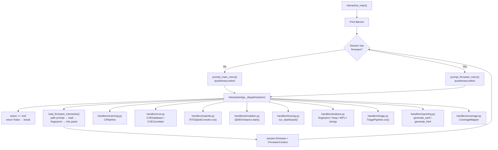

### Session State

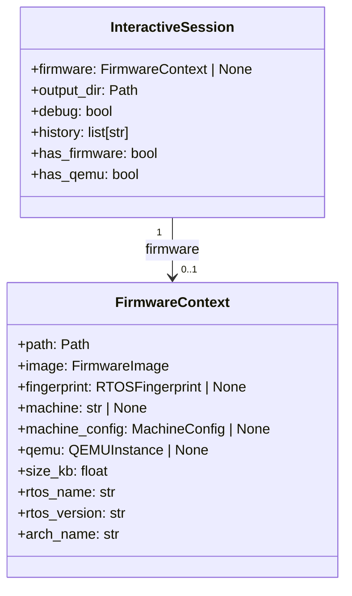

---

## CLI Layer

The CLI layer is a thin Click wrapper. Each subcommand file defines a single `@click.command`, validates inputs, and delegates to the core engine.

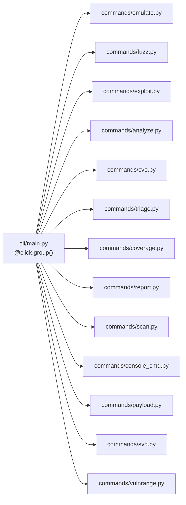

---

## Full Scan Pipeline

The `scan` command and `CIPipeline` orchestrate all phases in sequence:

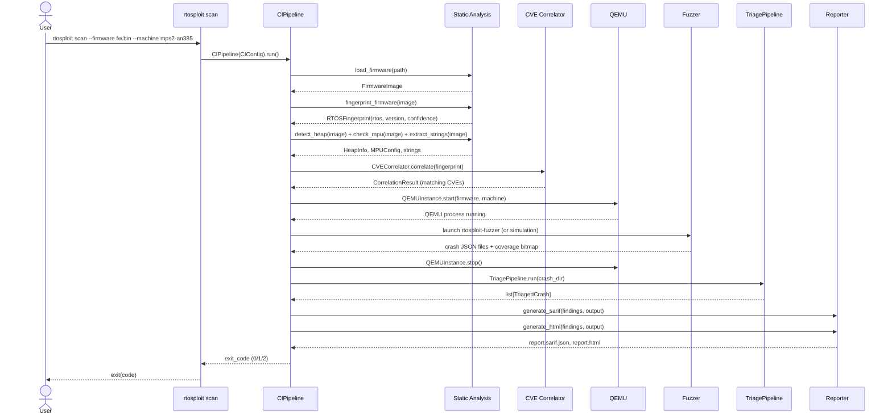

---

## Static Analysis Pipeline

Static analysis runs without QEMU and operates entirely on the firmware binary:

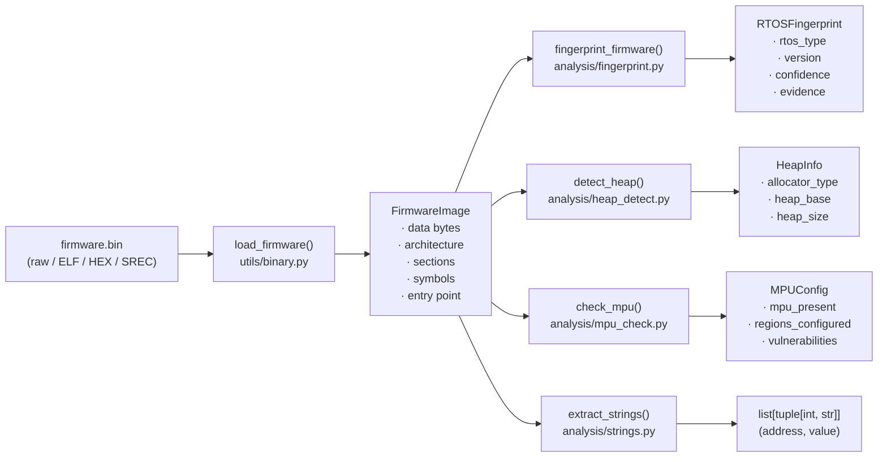

---

## Vulnerability Scanner Architecture

All scanner modules follow the `ScannerModule` abstract base class. The registry discovers them at runtime via Python's `importlib`.

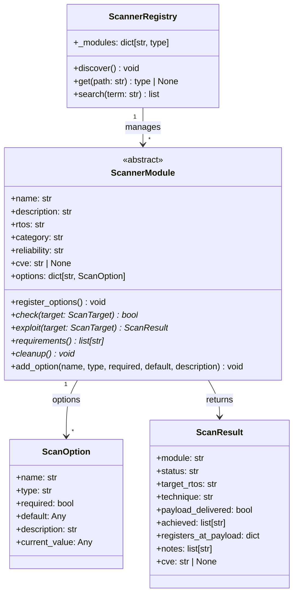

### Module Discovery Flow

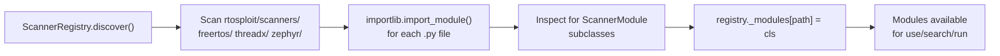

---

## Fuzzing Architecture

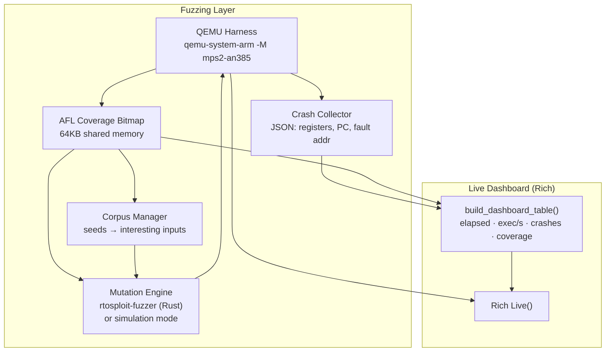

The shared `dashboard.py` module is imported by both `cli/commands/fuzz.py` (CLI mode) and `interactive/handlers/fuzzing.py` (interactive mode), ensuring identical rendering in both paths.

---

## Crash Triage Pipeline

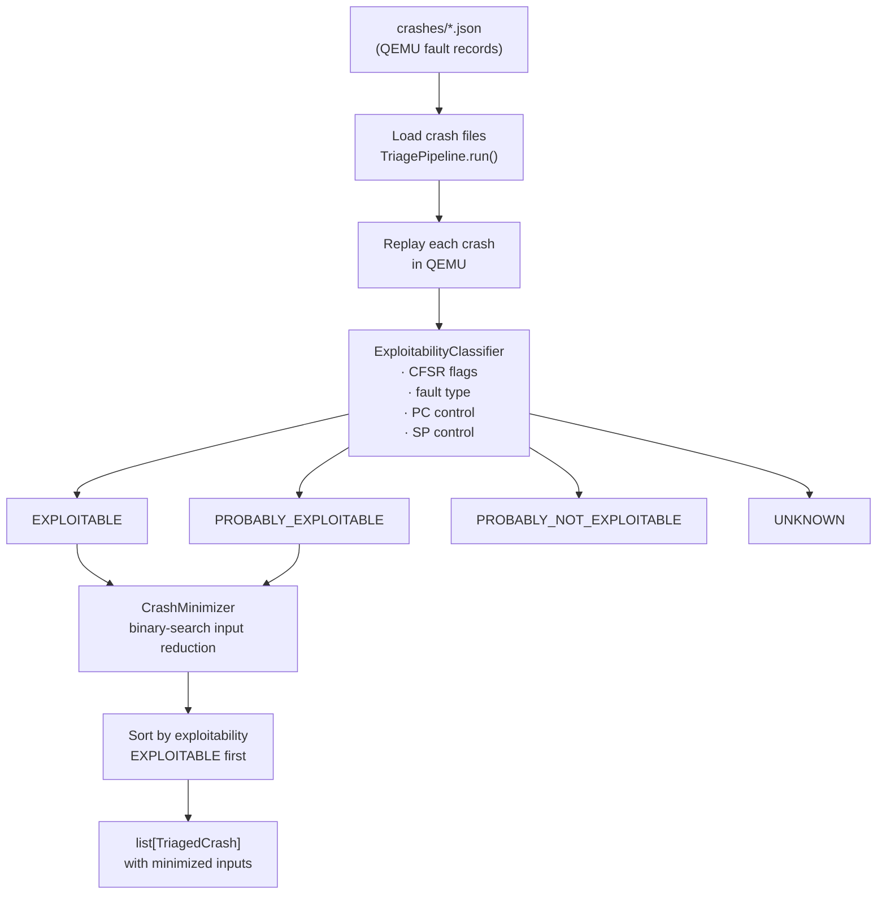

---

## CVE Intelligence Architecture

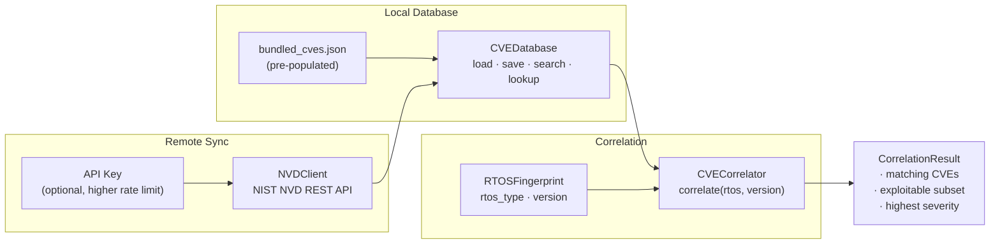

---

## Reporting Pipeline

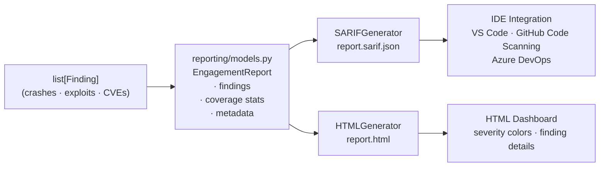

### SARIF Structure

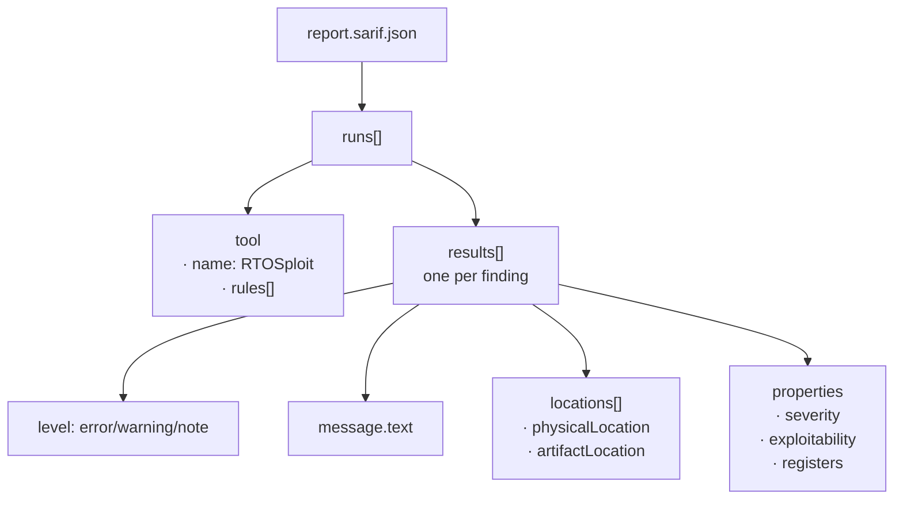

---

## Payload Generation

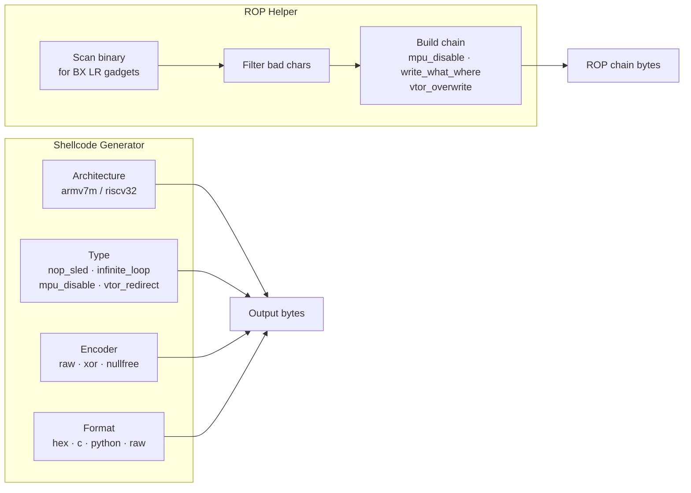

---

## Configuration System

RTOSploit uses a layered configuration system with clear precedence:

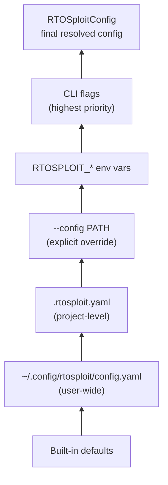

**Config sections:**

```yaml
qemu:
  binary: qemu-system-arm    # QEMU binary path
  timeout: 30                # Process timeout (seconds)

gdb:
  port: 1234                 # Default GDB port

output:
  format: text               # text | json
  color: true                # Enable Rich colors

logging:
  level: info                # debug | info | warning | error

fuzzer:
  default_timeout: 120       # Default fuzz duration
  jobs: 1                    # Default parallel instances
```

---

## Machine Configuration Schema

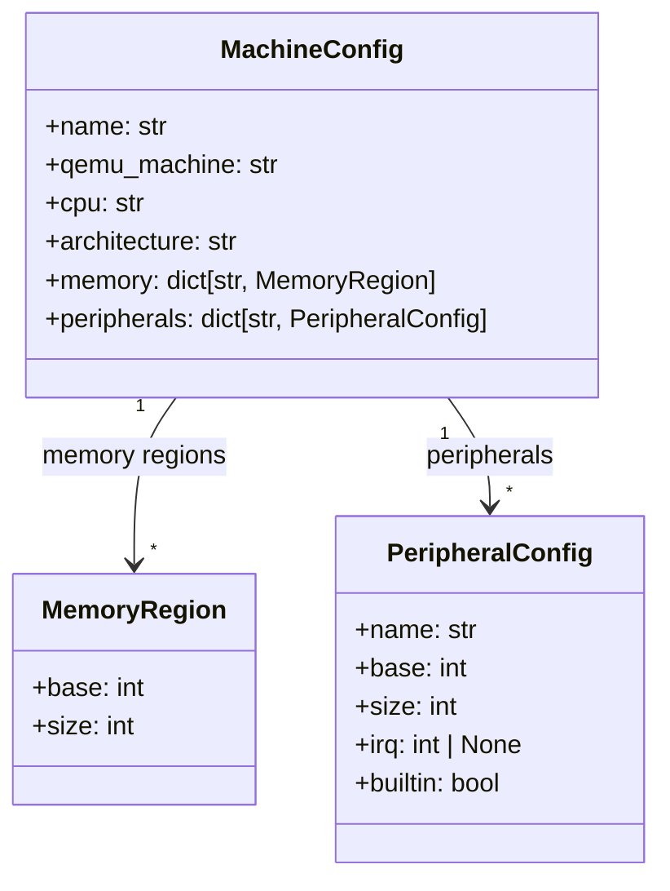

Machines are discovered from `configs/machines/*.yaml`. The file stem is the machine identifier. Memory region overlap is validated at load time.

---

## Console REPL Architecture

The Metasploit-style console is built on `prompt_toolkit` with a custom completer and Rich output:

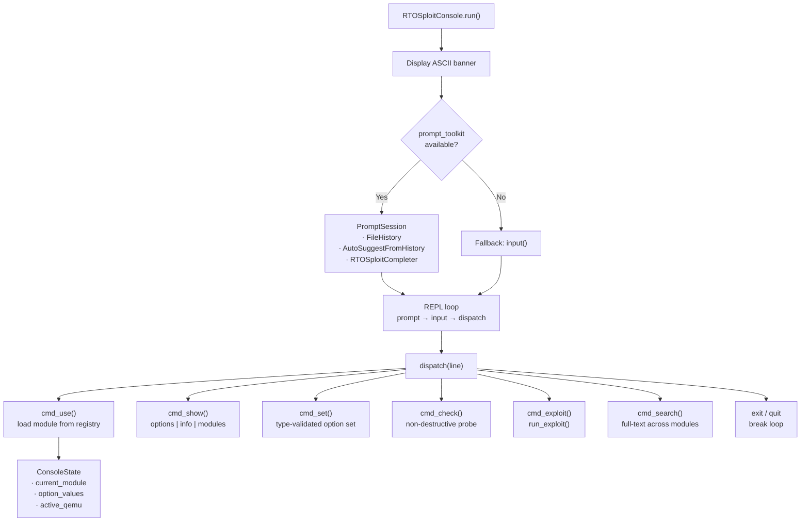

---

## Module Dependency Map

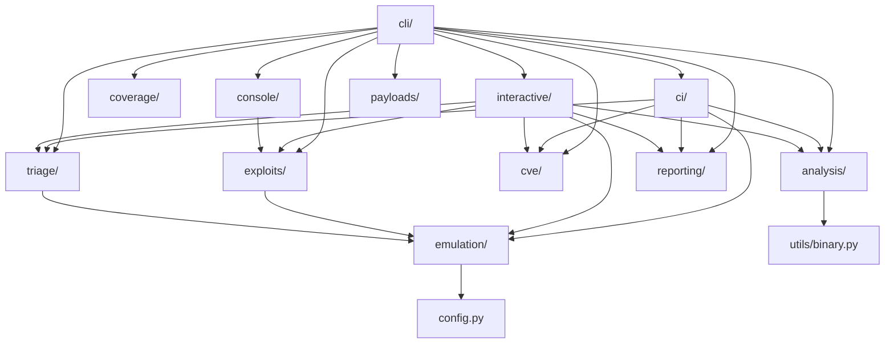

---

## Data Flow: Interactive Firmware Session

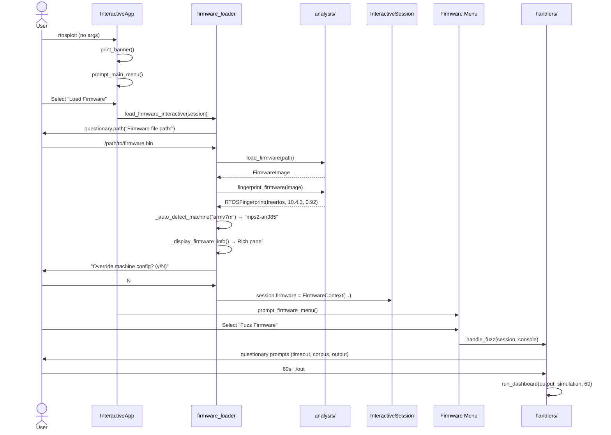

---

## Key Design Decisions

### Lazy Imports in Handlers
All interactive handlers use local imports inside functions. This means `questionary`, `rtosploit.emulation`, and other heavy modules are not imported at CLI startup — keeping `rtosploit --help` fast.

### Shared Dashboard Module
`interactive/dashboard.py` is imported by both `cli/commands/fuzz.py` and `interactive/handlers/fuzzing.py`. The dashboard rendering is identical whether you run `rtosploit fuzz` (CLI) or pick "Fuzz Firmware" from the interactive menu.

### Click `standalone_mode=False`
The CLI calls `cli(standalone_mode=False)` so exceptions propagate to `main()` for unified error handling with Rich panels and optional tracebacks.

### atexit Cleanup
`InteractiveApp.run()` registers `_cleanup()` with `atexit` so QEMU processes are always terminated — even on unexpected exits or exceptions.

### No Hardware Dependency
All emulation runs in QEMU. The code never opens raw serial ports or device files. Machine configurations are YAML-defined and the emulation layer validates QEMU binary presence and version at startup.
